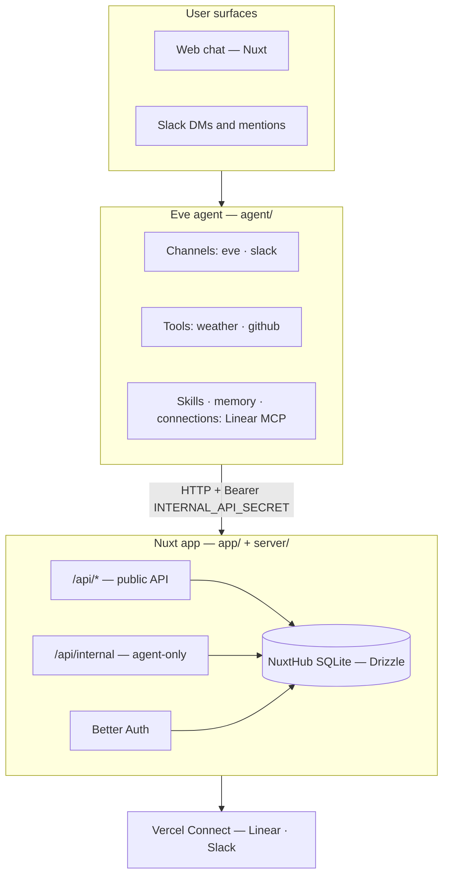

# Personal Agent Template — Architecture

> Back to [README](../README.md) | See also: [Environment](./ENVIRONMENT.md), [Customization](./CUSTOMIZATION.md)

This document describes the technical architecture of Personal Agent Template — a durable personal AI assistant built with Eve, Nuxt 4, and Better Auth.

## System overview

The app runs as two cooperating services on Vercel:



| Vercel service | Entry | Role |
|----------------|-------|------|
| `web` | `/` | Nuxt UI + Nitro API |
| `eve` | `/eve/v1/*` | Eve agent runtime (service generated by `eve/nuxt`) |

The `eve/nuxt` module generates the Vercel service and its `/eve/v1/*` route at build time — `vercel.json` does not declare them.

## Project structure

```
personal-agent-template/
├── agent/                    # Eve agent
│   ├── agent.ts              # Model and agent config
│   ├── channels/             # eve (web), slack
│   ├── tools/                # weather
│   ├── extensions/           # mounted eve extensions (github)
│   ├── memory/               # memory slots (profile)
│   ├── skills/               # e.g. daily-summary.md
│   ├── connections/          # Linear MCP
│   ├── lib/                  # slack-internal, internal-api
│   └── instructions.ts       # system instructions
├── app/                      # Nuxt frontend
│   ├── pages/                # chat, settings, login
│   ├── components/           # chat UI, profile, integrations
│   └── composables/          # useProfile, useConnectors, chat providers
├── server/                   # Nitro API
│   ├── api/                  # Public + internal routes
│   ├── db/                   # Drizzle schema + migrations
│   └── utils/                # profile, auth, connectors, threads
├── shared/                   # Cross-layer types and helpers
│   ├── agent.ts              # Branding metadata
│   └── types/                # profile, thread, connector
└── docs/                     # Documentation
```

## Request flows

### Web chat

1. User opens `/chat/[id]` — Nuxt loads thread via `/api/threads`
2. Chat streams through Eve's Nuxt module (`eve/nuxt`)
3. Tool calls render in [`MessageContentEve.vue`](../app/components/chat/message/MessageContentEve.vue)
4. Approvals and questions render through [`AgentInputRequest.vue`](../app/components/AgentInputRequest.vue)

### Memory recall

1. Eve resolves the `profile` slot's scope to the authenticated principal ([`agent/memory/profile.ts`](../agent/memory/profile.ts))
2. `fileMemory()` reads that principal's document from private Vercel Blob storage
3. The indexed entries are recalled on `turn.started` and again after compaction

Records arrive as untrusted user-role messages, never as system instructions.
The agent maintains them with `profile__save_memory` and `profile__remove_memory`.

### Slack

1. Slack events hit Eve's slack channel ([`agent/channels/slack.ts`](../agent/channels/slack.ts))
2. Linked users map Slack ID → app user via `slack_links` table
3. Unlinked users get instructions to generate a link code in the web app
4. Link flow: web generates code → user DMs `link <code>` → agent consumes via internal API

### Integrations (Linear)

1. User connects Linear in **Settings → Integrations**
2. Vercel Connect provisions MCP credentials
3. Eve connection ([`agent/connections/linear.ts`](../agent/connections/linear.ts)) exposes Linear tools to the agent

## Internal API

Routes under `/api/internal/*` require:

```
Authorization: Bearer <INTERNAL_API_SECRET>
```

Validated in [`server/utils/internal-api.ts`](../server/utils/internal-api.ts).

| Route | Purpose |
|-------|---------|
| `GET /api/internal/phone/link` | Resolve phone number → app user |
| `GET /api/internal/slack/link/member` | Resolve Slack user → app user |
| `POST /api/internal/slack/link/consume` | Consume link code |

Agent-side clients live in `agent/lib/*-internal.ts`.

## Database

SQLite via [NuxtHub](https://hub.nuxt.com). Schema in [`server/db/schema/`](../server/db/schema/).

Key tables:

| Table | Purpose |
|-------|---------|
| `user` / `session` / `account` | Better Auth |
| `threads` | Chat threads |
| `user_profile` | Name, timezone, phone |
| `phone_links` | Phone ↔ app user mapping (reserved for a messaging channel) |
| `slack_links` | Slack ↔ app user mapping |
| `slack_link_codes` | Temporary link codes |

Migrations: `pnpm db:generate` → `pnpm db:migrate`.

`server/db/schema/auth.ts` is generated by the Better Auth CLI, not hand-written. `db:generate` regenerates it before diffing the schema, so the adapter's expected tables and the migration cannot drift. Run `pnpm auth:schema` on its own after changing the Better Auth config.

## Memory model

- **Provider** — Eve's `fileMemory()`, one bounded document per scope
- **Scope** — `byPrincipal`: one document per authenticated caller
- **Storage** — private Vercel Blob, `eve/memory/file/<scope>/MEMORY.md`
- **Tools** — `profile__save_memory`, `profile__remove_memory`
- **Bounds** — 4,000 recalled characters, 2 KB per entry, 64 KB per document

## Auth

[Better Auth](https://www.better-auth.com) with email/password. Config: [`server/utils/auth.ts`](../server/utils/auth.ts), route: [`server/api/auth/[...all].ts`](../server/api/auth/[...all].ts).

Global middleware: [`app/middleware/auth.global.ts`](../app/middleware/auth.global.ts).

## Eve docs

For channels, tools, connections, and deployment details, read Eve guides in `node_modules/eve/dist/docs/public/`.
